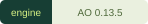
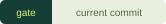
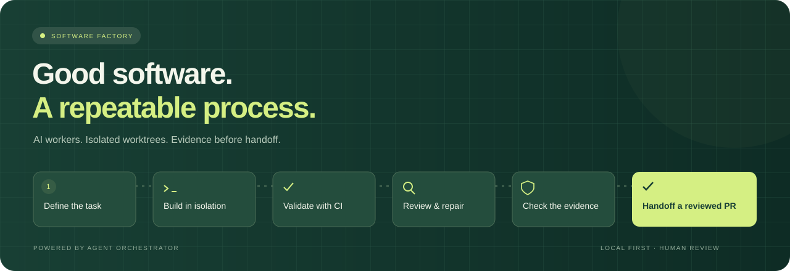
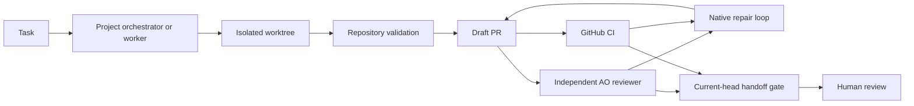

<p align="center"></p>

<p align="center"><strong>AI workers. Isolated worktrees. Evidence before handoff.</strong></p>

<p align="center">
  <a href="https://github.com/ArttuAn/software-factory/actions/workflows/factory.yml"></a>
  <a href="LICENSE"></a>
  <a href="UPSTREAM.json"></a>
  <a href="WORKFLOW.md"></a>
</p>

<p align="center"><a href="#start">Get started</a> · <a href="RESEARCH.md">Research</a> · <a href="WORKFLOW.md">Workflow</a> · <a href="VERIFICATION.md">Verification</a> · <a href="BRAND.md">Brand assets</a></p>



A working local factory built on **Agent Orchestrator v0.13.5**, with a browser supervisor and an evidence-based PR handoff gate. See [the research and comparison](RESEARCH.md) for why this foundation was selected.

## Start

Requirements: Linux x64, Python 3.10+, Git, authenticated `gh`, and a supported authenticated coding-agent CLI. There are no Python package dependencies. A fresh Git clone requires the bootstrap step below; it verifies and extracts the pinned upstream daemon.

```bash
git clone https://github.com/ArttuAn/software-factory.git
cd software-factory
python3 bootstrap.py
python3 factory.py serve
```

Open **http://127.0.0.1:48080**. Connect an existing local Git repository, enter its exact required GitHub CI check names, select an agent, and dispatch a task. Choose a single worker for a focused change or a project orchestrator to delegate a larger goal. Agent sessions consume the selected provider's allowance.

Default ports: supervisor `48080`, native daemon `48082`. Runtime state lives in `$XDG_STATE_HOME/software-factory` or `~/.local/state/software-factory`; it persists across restarts. The upstream account manager requires trusted directory ancestors, so avoid group-writable folders for state. `--state` and `--ao-port` precede the command; `--port` follows `serve`.

```bash
python3 factory.py doctor
python3 factory.py ao status
python3 factory.py ao session --help
python3 factory.py gate <worker-session-id> https://github.com/owner/repo/pull/123
python3 factory.py --ao-port 49082 --state /private/path serve --port 49080
```

The `ao` subcommand uses the same state and port as the supervisor. Use the native CLI for advanced operations and the upstream desktop client for the complete reviewer and structured-input interfaces. This browser supervisor implements task dispatch, native conversation inspection and follow-up, interruption, offered approval decisions, review triggering and readiness checks. It does not replace the full upstream desktop client.

## Pipeline and ownership



**Upstream owns execution:** persistent agent sessions, worktrees, orchestrator/worker coordination, GitHub observations, independent reviewer runtimes and CI/review feedback delivery. The extension talks to the native HTTP API; it never writes upstream SQLite or fabricates lifecycle facts. Upstream source is pinned in UPSTREAM.json and can be checked out with the command below; the extension does not vendor it into this repository.

**Factory additions:** [WORKFLOW.md](WORKFLOW.md) is injected when a repository is connected. Native auto-review and review feedback injection are enabled. The supervisor shows real daemon state. A separate read-only gate evaluates actual GitHub and AO evidence:

- PR is open and mergeability is known and clean.
- Every configured required check exists and succeeds; every observed check succeeds. Skipped and neutral results block.
- All review threads are resolved and GitHub has no outstanding change-request decision.
- An independent AO reviewer approved this PR's current head SHA; a later unfinished or rejected pass blocks.
- The head stays unchanged during evidence collection. Evidence is a point-in-time report.

Each completed gate assessment is saved under the runtime state's `gate-reports/` directory; the JSON response includes its path. GitHub review decisions are read directly as well as through branch-protection summaries, so unprotected repositories do not silently lose change-request evidence.

The readiness gate accepts draft PRs for human handoff. It never undrafts or merges them. Upstream board labels are derived by upstream and are **not** the factory gate's verdict.

The workflow's draft-PR/no-merge rules and three-worker limit are instructions, not enforced quotas or security controls. This is trusted local agent execution, not an untrusted-code sandbox. GitHub branch protection should enforce your repository's merge policy. No automatic issue intake is enabled by default; the upstream native CLI supports it when deliberately configured.

Updating WORKFLOW.md does not silently change running sessions or previously connected project configs. Reconfigure through the native project API/CLI for existing projects. Onboarding deliberately creates a new project and does not overwrite existing project settings.

## Before / After Proof

The [video lessons](VIDEO_NOTES.md) are applied through [AGENTS.md](AGENTS.md),
[build guidelines](CODE_STRUCTURE.md), and [captured proof](PROOF.md). Newly
connected projects must provide before/after command evidence at handoff.
Captures record actual exit status and output against clean commits in the
worker's isolated worktree. Optional screenshots and videos are preserved by
hash. The inspector shows the pairs; the gate rejects stale, failed or missing
proof. Independent review must judge whether the comparisons cover the task.
Existing connected projects keep their previous policies until deliberately
re-onboarded. No additional review service or account is required.

## Audit trails and evaluations

The **Audit & evals** dashboard provides separate histories for orchestrators, workers, reviewers, CI and gates; linked traces; saved operational evaluations; token usage when reported; journal verification and export; and real role probes with deterministic grading. The collector runs without an open browser. [OBSERVABILITY.md](OBSERVABILITY.md) explains evidence coverage, role benchmark semantics, APIs and checkpoint verification.

Role probes test bug fixing, defect detection, and planning in dedicated native worker sessions. They are narrow synthetic evaluations, not production PR success rates. Missing telemetry remains unknown. Audit state and transcripts stay outside Git.

## Verification

```bash
python3 -m unittest -v test_factory test_observability test_proof
node --check web/app.js
node --check web/observatory.js
```

The local suite covers gate failure cases, stale evidence, pagination, retry-safe dispatch and the native API boundary. Live smoke testing used the official binary and a disposable repository: native project configuration, a real Codex worker in a separate worktree, a real provider response, and browser interaction. See [VERIFICATION.md](VERIFICATION.md) for actual results and remaining validation gaps.

The GitHub workflow runs the extension checks as `Factory tests`. It does not execute model jobs or download the daemon in CI.

The first production PR requires a target repository and task. No live PR was created just to demonstrate the UI. Real GitHub publication, CI repair and independent PR review therefore remain to be exercised on your chosen repository; the gate's logic is tested with controlled evidence.

## Reproduce the upstream runtime

[UPSTREAM.json](UPSTREAM.json) records the exact tag, commit and SHA-256 hashes. If `runtime/ao` is missing:

```bash
python3 bootstrap.py
git clone --depth 1 --branch v0.13.5 https://github.com/OrchestratorInc/agent-orchestrator.git upstream
```

The bootstrap downloads the official Linux x64 `.deb`, verifies both package and daemon hashes and extracts the daemon without system installation. The source tree has its own repository history and Apache-2.0 license. A copy of the upstream license and the release's copyright notice accompany the bundled daemon. For other platforms, use the [official desktop release](https://github.com/OrchestratorInc/agent-orchestrator/releases/tag/v0.13.5); this bootstrap is Linux x64 only.

The supervisor and native daemon bind loopback only. Supervisor mutations require a per-process CSRF token and same-origin/Host checks. The upstream loopback API remains locally accessible as designed. Do not expose either port through a public tunnel. Telemetry is disabled in the launcher.

Ctrl+C stops the supervisor and gracefully requests its owned daemon to stop. `serve --connect` attaches to a separately managed daemon and leaves it running on exit. Advanced runtime recovery and cleanup remain native AO responsibilities; the extension does not delete worktrees.

## Project organization

Use the issue templates for bug reports and feature requests. Labels distinguish work type, product area, priority and blocked/ready status. GitHub topics identify the project as a local AI-agent orchestration and pull-request workflow. `v0.1.0` identifies this factory extension; upstream Agent Orchestrator is independently pinned to `v0.13.5`.

The original vector logo, workflow cover and interface icons live in [web/assets](web/assets). [BRAND.md](BRAND.md) documents the palette and status semantics. Runtime state, credentials, downloaded binaries and the upstream checkout are excluded from Git.
